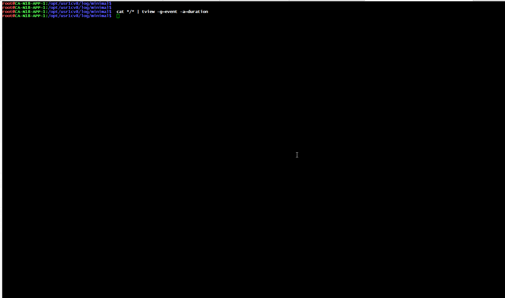
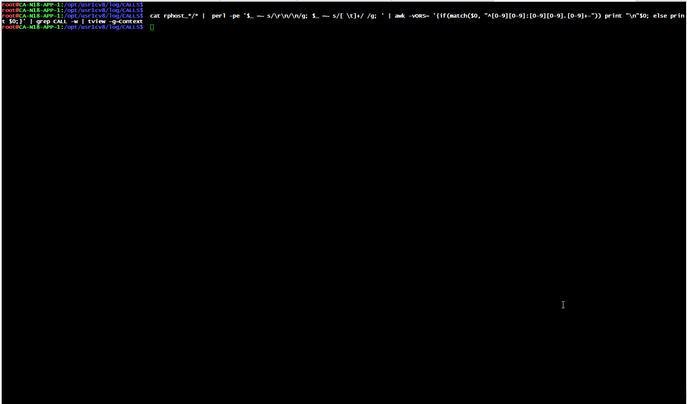
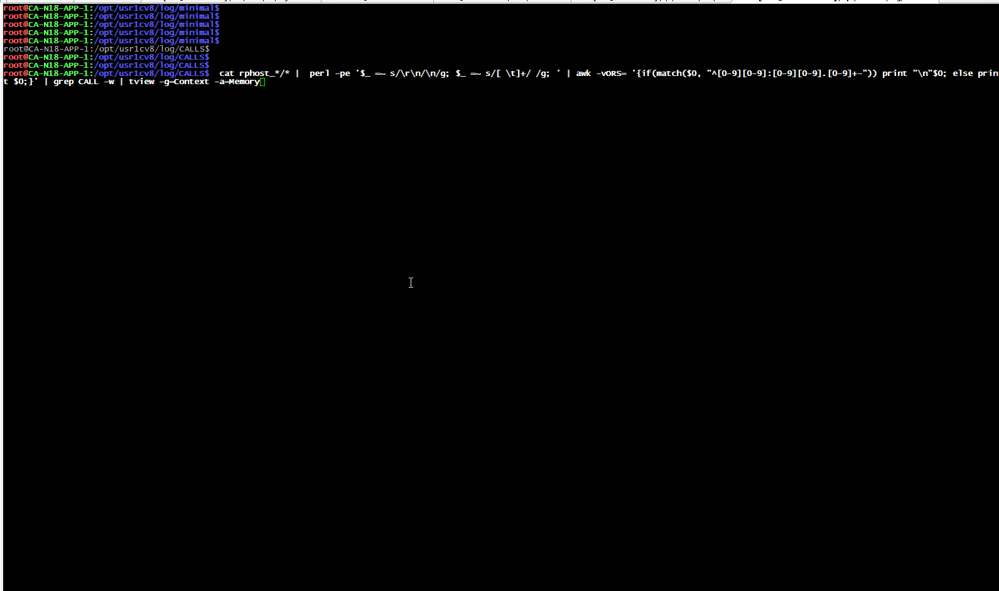

### LogViewer
Утилита для удобного просмотра логов (в текущей реализации поддержка формата логов технологического журнала 1С). Утилита имеет два параметра `-g` и `-a`, -g (group) перечисляются имена свойств для группировки, -a (aggregate) указывается именя свойства по которому будет считаться сумма, среднее и максимум, например Memory. Группировать и агрегировать можно так же по событиям и по длительности, event, duration соответственно. 



тут было добавлено 

```` 
perl -pe '$_ =~ s/\r\n/\n/g; $_ =~ s/[ \t]+/ /g; ' | awk -vORS= '{if(match($0, "^[0-9][0-9]:[0-9][0-9].[0-9]+-")) print "\n"$0; else print $0;}' 
```` 
что бы избавиться от артефактов многострочных логов

---
 

Вызовы с группировкой по контексту и агрегация по Memory
 

Вызовы с группировкой по контексту и агрегация по duration
 


### Начать использовать
Качаем актуальный [релиз](https://github.com/LazarenkoA/LogViewer/releases ) помещаем биналник в PATH, все


### Key bindings
Клавиша                                     | Описание
----------------------------------------|---------------------------------------
<kbd>Enter</kbd>                          | Включить режим выделения (можно перемещать курсор). Во включеном режиме выделения копирует содержимое ячейки в буфер обмена и выходит из режима выделения
<kbd>Tab</kbd>                    | Во включенном режиме выделения отображает исходные строки логов (:warning: не стоит пользоваться данной функцией если количество в текущей строке больше тысячи, может зависнуть)
<kbd>Esc</kbd>                       | Выход из просмотра исходных строк, из режима выделения, из программы в целом
