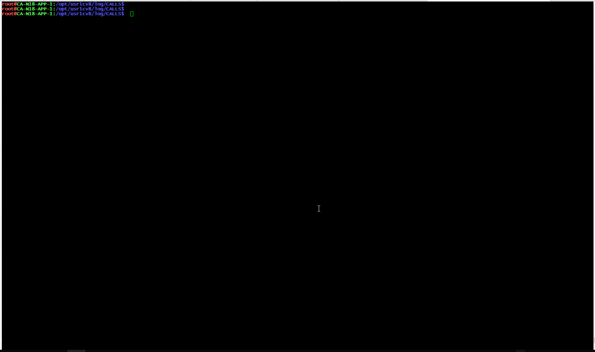

### LogViewer

[](https://github.com/LazarenkoA/LogViewer/blob/master/LICENSE)
[](https://travis-ci.org/LazarenkoA/LogViewer)


Утилита для удобного просмотра логов (в текущей реализации поддержка формата логов технологического журнала 1С). 
#### Параметры
````
-g, --group=GROUP          Имена свойств для по которым нужно группировать (через запятую)
-a, --aggregate=AGGREGATE  Имя свойства для агрегации (сумма, макс, ср). Например например Memory, MemoryPeak
-s, --savelines            Если true значит уприложение будет сохранять
                             исходные строки, что бы можно было посмотреть что
                             вошло в ту или иную группировку. Требует много
                             оперативной памяти.
````
Группировать и агрегировать можно так же системным свойствам, `event, duration, time, minutes, seconds`. 


тут было добавлено 

```` 
perl -pe '$_ =~ s/\r\n/\n/g; $_ =~ s/[ \t]+/ /g; ' | awk -vORS= '{if(match($0, "^[0-9][0-9]:[0-9][0-9].[0-9]+-")) print "\n"$0; else print $0;}' 
```` 
что бы избавиться от артефактов многострочных логов

---
 

Вызовы с группировкой по контексту и агрегация по Memory
 

Вызовы с группировкой по контексту и агрегация по duration
 


Анализ сколько провисели на управляемых блокировках и на каких ресурсах
 

Анализ тяжелых запросов
 


### Начать использовать
- Качаем актуальный [релиз](https://github.com/LazarenkoA/LogViewer/releases ) помещаем бинарник в PATH, все.
- Ставим [Go](https://blog.golang.org/), выполняем `go get github.com/LazarenkoA/LogViewer` _(в этом случае бинарник будет называться LogViewer)_
- Ставим [Go](https://blog.golang.org/), `git clone https://github.com/LazarenkoA/LogViewer`, переходим в каталог `go build -o "tview"` или `go build -o "tview.exe"` полученный  бинарник помещаем в PATH, все. 


### Key bindings
Клавиша                                     | Описание
----------------------------------------|---------------------------------------
<kbd>Enter</kbd>                          | Включить режим выделения (можно перемещать курсор). Во включеном режиме выделения копирует содержимое ячейки в буфер обмена и выходит из режима выделения
<kbd>Tab</kbd>                    | Во включенном режиме выделения отображает исходные строки логов (:warning: не стоит пользоваться данной функцией если количество в текущей строке больше тысячи, может зависнуть)
<kbd>Esc</kbd>                       | Выход из просмотра исходных строк, из режима выделения, из программы в целом


---
:warning: Для того что бы работал буфер обмена в linux должна быть установлена одна из утилит `xsel`, `xclip`, `wl-clipboard` или Termux: API-дополнение для termux-clipboard-get / set.

